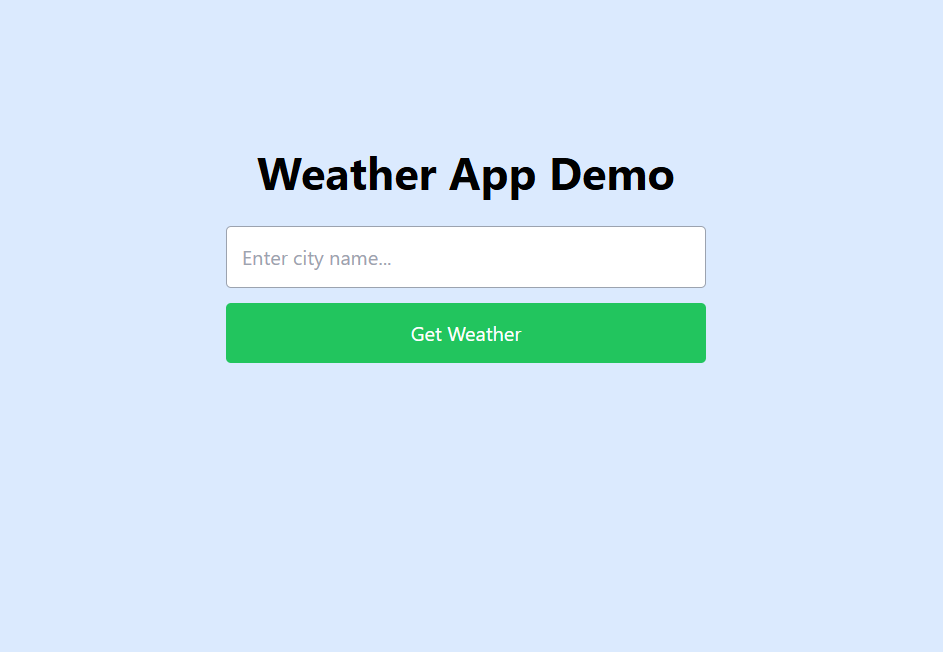
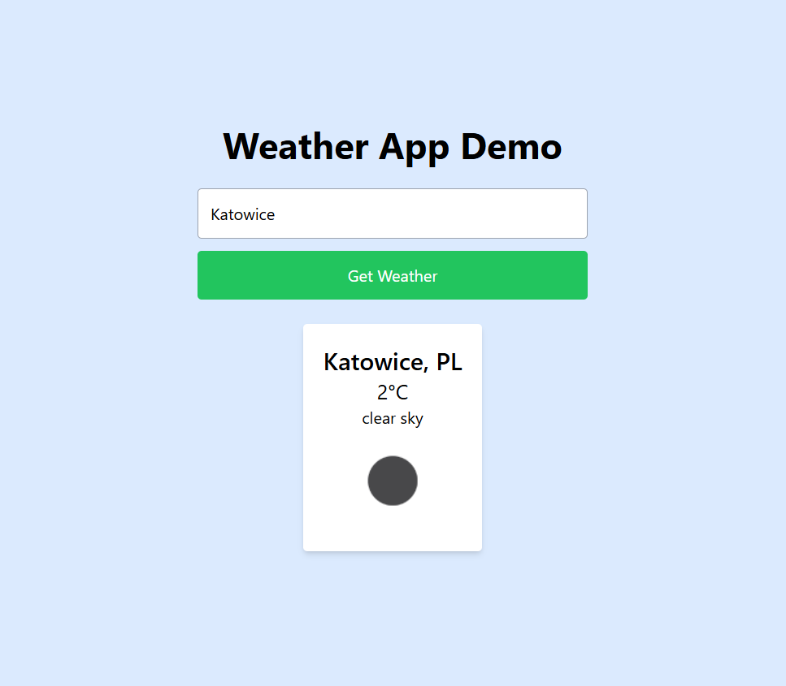

# Weather App Demo

A responsive weather application built with modern web technologies. Users can search for current weather conditions by city name, displaying temperature, description, and weather icons powered by the OpenWeatherMap API. This project showcases full-stack development skills, including API integration, state management, and responsive UI.

  

## Features
- **Real-time Weather Data**: Fetch current weather via OpenWeatherMap API.
- **Responsive Design**: Mobile-friendly UI with Tailwind CSS.
- **Error Handling**: Graceful handling of invalid cities or API errors.
- **TypeScript Support**: Fully typed for robustness and developer experience.

## Tech Stack
- **Frontend**: Next.js 14, React 18, TypeScript
- **Styling**: Tailwind CSS
- **API**: [OpenWeatherMap](https://openweathermap.org/api) (free tier)
- **Deployment**: [Vercel](https://vercel.com)
- **Other**: ESLint, Prettier (for code quality)

## Screenshots
### Home Page
  
*(Enter a city and fetch weather instantly.)*

### Weather Result
  
*(Displays temperature, description, and icon for Katowice, PL.)*

## Getting Started
### Prerequisites
- Node.js 18+ 
- Free API key from [OpenWeatherMap](https://openweathermap.org/api) (sign up and generate under API Keys)

### Installation
1. Clone the repository:
